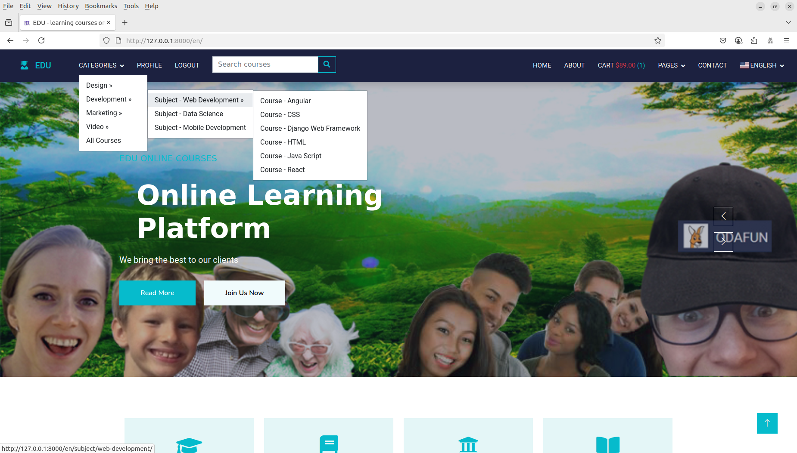
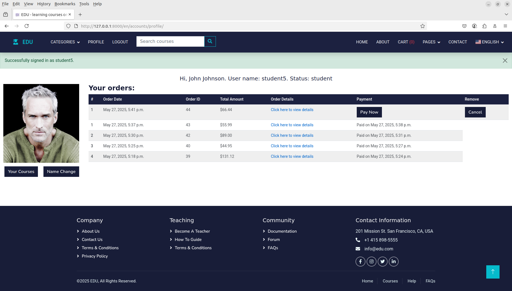
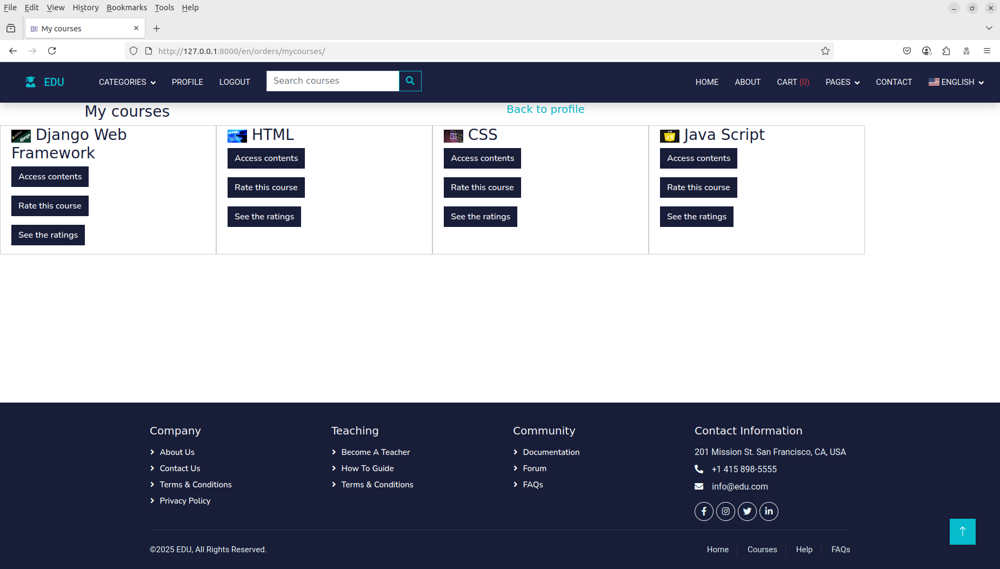
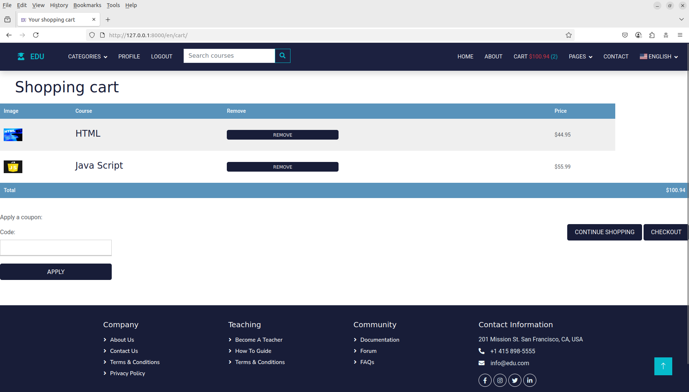
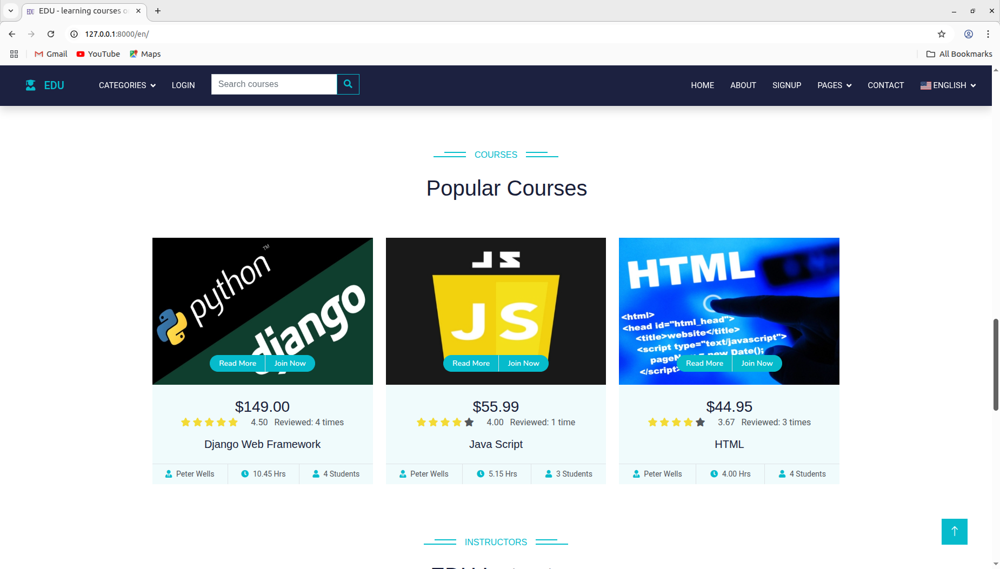

Online education platform created with Django 5.1.7, Postgresql, Bootstrap 5, memcached, uWSGI, NGINX and Docker container.
It has partially implemented Django REST framework Web API for dynamic dropdown menu used to access categories, subjects and courses.

Home page with dynamic dropdown menu

Student profile page

Student courses

Shopping cart

Best rated courses

